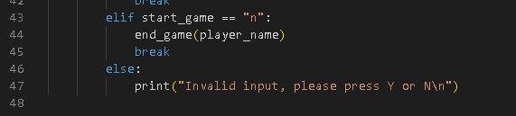

# Hangman
This is a classic Hangman game. In the original game you play this with a friend that choose the hidden word. In this case the computer randomizes a word for you, and it's your job to guess the word before you run out of guesses. 

## Live Site
[Heroku](https://stealthy-hangman.herokuapp.com/)
## Repository
[GitHub](https://github.com/Stealthy20/hangman)
## Planning 
### Flowchart
-   Before I started this project I made a flowchart to make sure that I knew what I wanted to code and what the code should do. 
This made me start the project with a plan and a starting point for my game.
I made changes along the way. Especially to make it better for the user with user stories in mind. But this flow chart was the starting point for the project.

### User stories
-   When I started this project I sat down to think about what I needed to do to make this game better, more fun, and smoother for the user. I came up with the following things that I wanted to implement to make this happen.
 -  User Stories
    -   I want the user to input their name and make it come back during the game to accomplish the feeling that the game is for the user.
    -   I want the user to know when and why the input wasn't valid. So I made sure that this was clear in the messages. 
    -   I want the user to see what letters they already guessed so they don't need to remember that to themselves. Would be irritating with an error message that they already guessed a letter if they can't see the previous guesses. 
    -   I want the user to be able to play again without refreshing the page. So I added the option after the game finishes to type "y" to play again.

## Features 

### Existing Features
-   Intro Screen with rules.
    - Input for the user to input their name.
    - Input to start the game. 

-   The first play screen where the user is met with the hidden word.
    -   A print to tell the user how long the word is.
    -   Input to make their first guess. 

-   A print to let you know if your guess was invalid, correct, or incorrect.
    -   If the guess was invalid the user is met with a text telling them what input is expected.
    -   If the guess is correct it appears in the hidden word and the guess is added to Guessed Letters
    -   If the guess was incorrect the amount of guesses goes down and the guess is added to Guessed Letters

-   When the game is done the user gets a message that they won or lost and the option to play again.
    -   If the user didn't guess the right word the game lets the user know what the word was. 
    -   If the user says they wanna play again the game randomizes a new word with new guesses. 
    -   If the user says no they are met with a goodbye message. 

### Future Features
-   I want to add the choice of playing this with a friend. Where one player chooses the word and the other tries to guess it. 
-   A scoring system for two-player mode so two players can compete. 

## Testing
I have tested this project as it was built. Every function and part of bigger functions have been tested seperatly to make sure that they work on their own. 
The project is also tested as a whole game to make sure everything works together. It's tested in my console and Heroku Terminal. 
This is done by myself and together with my mentor to get extra pairs of eyes. 
I will show some of the bugs I found and how I resolved them here below. 

## Bugs
Here is an example of some of the bugs and problems that I encountered during the making of this project and how I resolved them. 
No remaining bugs should be left in this project. 

### Bug 1
-   I got an error message when the user did an invalid input and the function should run again to make the user do a new input. 

### Bug 1 fix 
-   I couldn't call the function within the function itself. So I wrapped it in a while loop, that is going until a valid input is made.  

### Bug 2
-   I got an error message when I tried to reuse the user's name in different functions in the game.

### Bug 2 fix
-   After a lot of research and two contacts with the student support, I realized that I forgot to pass the argument everywhere that I call this function. 

### Bug 3
-   I had a problem where the guessed letters didn't appear in the right spot in the word. And sometimes the _ wasn't correctly removed. 

### Bug 3 fix
-  I had a wrongly added space in the code. Which made the word longer and letters appear in the wrong place. I removed the space and everything worked. Added a print to show how many letters the word is since that became harder to see without the space. 

### Bug 4
-   The user was able to guess the same letter multiple times. And every time it counted as a new guess. 

### Bug 4 fix
-   I had the wrong keyword in the function. I had a IS instead of IN, which made it compare if it was the same not if the letter was in the list.

### Validator Testing
- No errors when I ran the code through the pep8online.com validator.

## Deployment
This app was deployed using Code Insitute's mock terminal for Heroku.

### Deploy to Heroku. 
- Go to Heroku.com and create a free account. 
    - Press create a new app. 
    - Go to setting.
    - Add the Python and Node.JS Build back.
    - It's important that they are in that order.
    - Go back to Deploy and choose Deployment Method Github.
    - Connect your GitHub.
    - Search for the repository name and press connect.
    - Choose Automatic or Manual deployment.

### Forking the Guthub Repository.
- You can fork the original GitHub Respository to be able to view or make changes without it affecting the original repository.
  - Go to the GitHub repository.
  - in the top right, press the button named "Fork".
  - You will now have a copy of the repository in your own GitHub. 

### Make a Local Clone
- Go to the GitHub Repository.
  - Click the "Clone" button in the top of the repository.
  - Copy the link.
  - Open Git Bash.
  - Change the current working directory to the location where you want the cloned directory.
  - Type git clone, and then paste the URL you copied earlier.
  - Press Enter to create your local clone.

## Credits
- Code institute for the deployment terminal
- My mentor Harry Dhillion for great advice and feedback
- Guide used for inspiration and guidance [Kite](https://www.youtube.com/watch?v=m4nEnsavl6w)
- Random Words generated from (https://randomwordgenerator.com/)