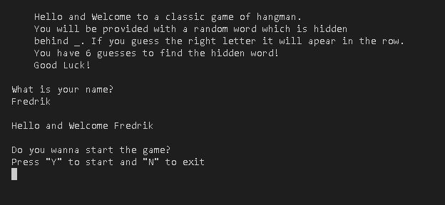

# Hangman
This is a classic Hangman game. In the original game you play this with a friend that choose the hidden word. In this case the computer randomizes a word for you, and it's your job to guess the word before you run out of guesses. 

Add Mockup

## Live Site
Add live sit
## Repository
[GitHub](https://github.com/Stealthy20/hangman)
## Planning 
### Flowchart
-   Before i started this project i made a flowchart to make sure that i knew what i wanted to code and what the code should do. 
This made me start the project with a plan and a starting point for my game.
I made changes along the way. Espacially to make it better for the user with user stories in mind. But this flow chart was the starting point for the project.

### User stories
- When i started this project i sat down to think about what i needed to do to make this game better, more fun and smoother for the user. I came up with the following things that i wanted to implement to make this happen.
- User Stories
    -   I want the user to input their name and make it come back during the game accomplish the feeling that the game is for the user.
    -   I want the user to know when and why the the input wasn't valid. So i made sure that this was clear in the messages. 
    -   I want the user to see what letters they already guessed so they don't need to remember that to themselves. Would be irritatin with a error message that they already guessed a letter if they can't see the previous guesses. 
    -   I want the user to be able to play again without refreshing the page. So i added the option after the game finishing to type "y" to play again.

## Features 

### Existing Features
-   Intro Screen with rules.
    - Input for the user to input their name.
    - Input to start the game. 

-   The first play screen where the user is met with the hidden word.
    -   A print to tell the user how long the word is.
    -   Input to make their first guess. 

-   A print to let you know if you guess was unvalid, correct or incorrect.
    -   If the guess was unvalid the user is met with a text telling them what input is expected.
    -   If the guess is correct it appers in the hidden word and the guess is added to Guessed Letters
    -   If the guess was incorrect the amount of guesses goes down and the guess is added to Guessed Letters

-   When game is done the user gets a message that they one or lost and the option to play again.
    -   If the user didnt guess the right word the game let's the user know what the word was. 
    -   If the user says they wanna play again the game randomizes a new word with new guesses. 
    -   If the user says no they are met with a goodbye message. 

# Features
**This site contains the following content**
We immediately start playing the Rock, Paper, Scissors game when the website first launches.
You have the option to enter your name here, and it will appear in the game. If left blank, "Player" will be shown in its place.
